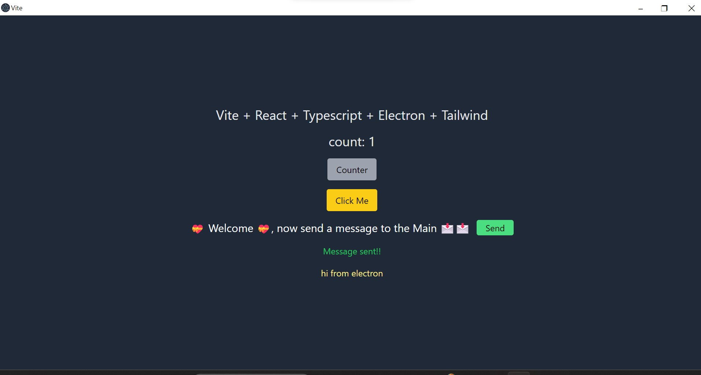

# Vite + React + Typescript + Electron - Starter

> It is a simple starter template without unnecessary packages.

This very simple updated Starter template, utilizes [Vite](https://github.com/vitejs/vite), [Tailwind](https://tailwindcss.com/), [React](https://reactjs.org/), [Typescript](https://www.typescriptlang.org/) and [Electron](https://electronjs.org/). cloned from this repo [Github](https://github.com/ZakiSoukeur/vite-reactts-electron-starter) props to the original author [maxstue](https://github.com/maxstue)

By default, the React framework is used for the interface, but you can easily use any other framework such as Vue, Preact, Angular, Svelte or anything else.

## Installation

Clone this repo and install all dependencies  
`yarn` or `npm install`

## Development

`yarn dev` or `npm run dev`

## Build

`yarn build` or `npm run build`

## Publish

`yarn dist` or `npm run dist`

Links: 
- [vite-react-electron](https://github.com/caoxiemeihao/vite-react-electron)
- [electron-vite-react](https://github.com/twstyled/electron-vite-react)
- [vite-electron-esbuild-starter](https://github.com/jctaoo/vite-electron-esbuild-starter)

Happy Coding 🙂
